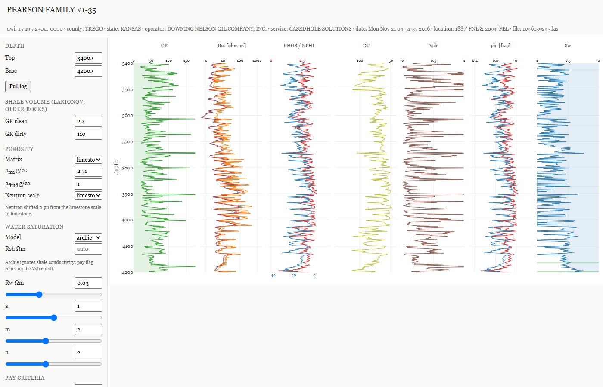
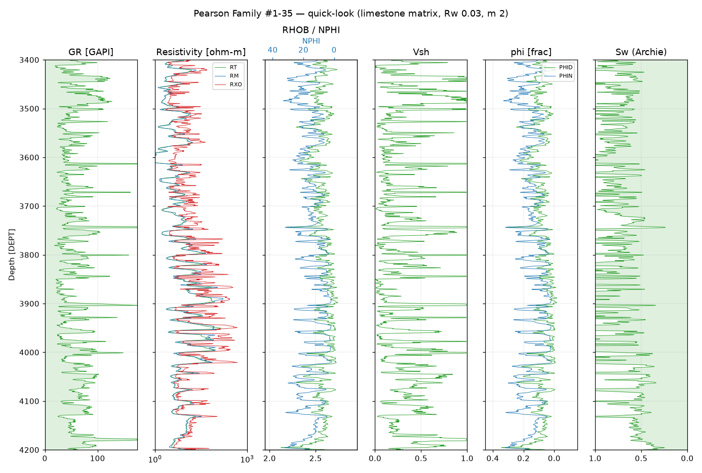
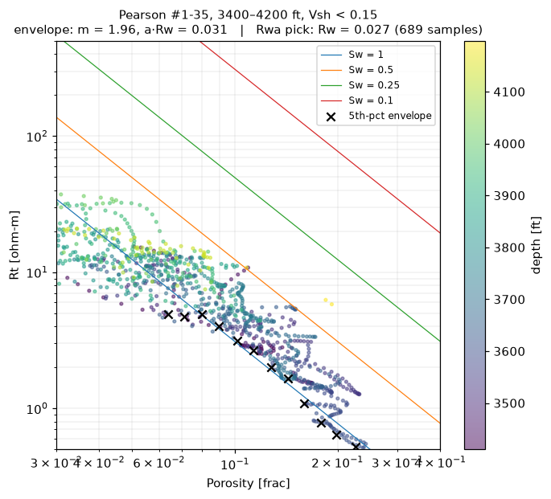
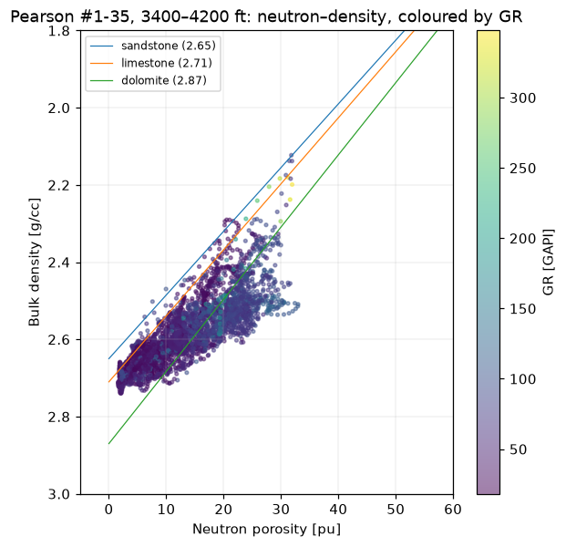
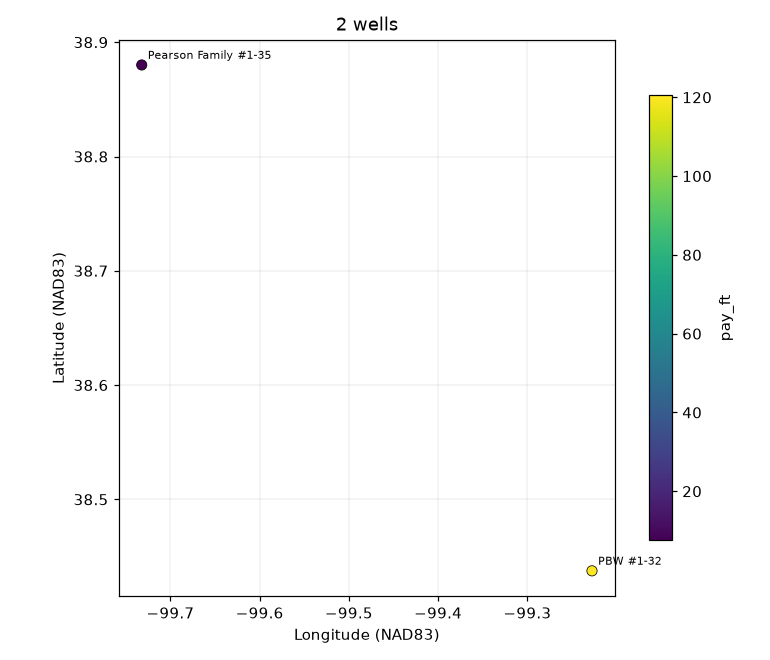

# LASanalysis

[](https://github.com/mjorden/LASanalysis/actions/workflows/ci.yml)
[](https://mjorden.github.io/LASanalysis/)

Quick-look petrophysics for LAS well logs from the Kansas Geological Survey:
load a log, mask the sentinels the service company never declared, draw it on
one shared depth axis, pick Rw and m from the log itself, and compute Vshale,
porosity, water saturation and pay — for one well in a notebook or for a
township at a time from the command line. Every well can be opened as a
self-contained interactive page with live sliders.

**Live viewers:** <https://mjorden.github.io/LASanalysis/>

[](https://mjorden.github.io/LASanalysis/pearson.html)

*The viewer for Pearson Family #1-35. Zoom any track and all follow; drag Rw,
m, n, the matrix or the GR picks and Vsh, porosity, Sw, pay shading and the
Pickett panel recompute in the browser.*

## Quick start

Python 3.10+ (verified on 3.12).

```bash
pip install -r requirements.txt -e .

# one well: static track plot + derived curves + summary row
python -m lasanalysis.multiwell --las data/1046139243.las --out output/pearson --depth 3400 4200

# the same well as an interactive page
python -m lasanalysis.viewer data/1046139243.las -o output/pearson.html --depth 3400 4200

# every well with an LAS file within 25 km of a point, from KGS's offline index
python -m lasanalysis.multiwell --index --within 38.88 -99.73 25 --out output/near_pearson

# or scrape the KGS search for a section
python -m lasanalysis.multiwell --township 13 --range 22 --ew W --section 35 --out output/T13S_R22W_35
```

`jupyter notebook KansasLAS.ipynb` walks through the whole workflow on one well.

## What it does



*`plot_tracks`: GR (shaded), deep/medium/shallow resistivity, density with a
twin neutron axis, and the derived Vsh, porosity and Sw tracks, on one
inverted depth axis set exactly once.*

| Step | Where | Notes |
|---|---|---|
| Load and clean | `lasanalysis.load` | lasio plus four sentinel rules the file does not declare: off-scale resistivity (`1e5`), `-999.0` in RHOB, out-of-range porosity and bulk density. Reports what it masked. [Details](docs/methods.md#cleaning) |
| Standard names | `lasanalysis.load` | `RILD` → `RT`, `CNPOR` → `NPHI`, … so code written for one service company runs on another |
| Petrophysics | `lasanalysis.petro` | Pure numpy: Vsh (linear, Larionov), density porosity, neutron lithology correction, N-D crossover, Archie / Simandoux / Indonesia Sw, Pickett water-line fit, Rwa pick, Rsh pick |
| Plots | `lasanalysis.plot` | Declarative track plots, neutron-density crossplot, Pickett plot |
| Interactive viewer | `lasanalysis.viewer` | One HTML file per well, Plotly.js, no server |
| KGS client | `lasanalysis.kgs` | Search (online or offline index), fetch by KID, well coordinates and header |
| Batch | `lasanalysis.multiwell` | search → fetch → analyse → `summary.csv` + track plot (+ viewer) per well, location map |
| Pages site | `lasanalysis.site` | Builds the live viewers on every push |

### Picking Rw and m from the log



No water analysis exists for these wells, so Rw and m come from the log two
independent ways: a fit to the low-Rt envelope of the Pickett plot (slope −m,
intercept a·Rw) and a low percentile of apparent water resistivity
Rt·φ^m over clean, porous samples. On Pearson they agree (0.031 / 0.027,
m ≈ 2.0); on PBW #1-32 the envelope wanders across a mixed section and the
Rwa pick is the one to trust. Both are written to `summary.csv` for every
well so a disagreement is visible. [How the picks were made](docs/methods.md#rw-and-m)

### Where the wells are

 

*Left: neutron–density crossplot with matrix lines, coloured by GR. Right: the
location map `multiwell` writes for every batch, from NAD83 coordinates read
off each well's KGS page.*

## Data

Both files come from the [KGS LAS File Database](https://www.kgs.ku.edu/Magellan/Logs/),
filed by the Kansas Corporation Commission ("LAS File, courtesy KCC").
Operator Downing-Nelson Oil Co. Inc.; logging contractor Casedhole Solutions.
They are redistributed as-is; the code license (MIT) does not cover them —
see the [KGS data resources page](https://www.kgs.ku.edu/General/dataLib.html).

| File | LAS KID | Well | API | County | Logged | Notes |
|---|---|---|---|---|---|---|
| `data/1046139243.las` | 1046139243 | Pearson Family #1-35, T13S R22W Sec 35 | 15-195-23011 | Trego | 2016-11-21 | LAS 2.0, 0.25 ft, 0–4360.75 ft, 20 curves; D&A |
| `data/1045399712.csv` | 1045399712 | PBW #1-32, T18S R17W Sec 32 | 15-165-22116 | Rush | 2015-09-25 | Converted from a CR-terminated export; 0.5 ft, 0–3853 ft; Arbuckle producer, P&A 2019 |

## Documentation

- [docs/methods.md](docs/methods.md) — the petrophysics: cleaning rules,
  aliases, Vsh, porosity and the neutron scale, Rw/m picks with their
  sensitivity tables, Sw models, the pay flag, what `summary.csv` contains.
- [docs/kgs.md](docs/kgs.md) — the KGS data sources: the two kinds of KID,
  URL patterns, the search and well pages, the offline index and its quirks,
  what the client refuses to do.
- [RFC #32](https://github.com/mjorden/LASanalysis/issues/32) — the planned
  basin-scale geochemistry (SRA / Rock-Eval, XRD) layer.
- [`KansasLAS.ipynb`](KansasLAS.ipynb) — the worked example.

## Development

```bash
pytest                                        # 74 tests, ~25 s
python -m playwright install chromium         # once, for the viewer browser test
python scripts/build_notebook.py              # regenerate the notebook (outputs stripped)
python scripts/build_docs_images.py           # regenerate docs/images/ from the data
python -m lasanalysis.site site/              # build the Pages site locally
```

The notebook is committed with outputs stripped (`pre-commit install` sets up
`nbstripout`); CI executes it end to end, runs the suite including the
headless-browser test, and deploys the site on every push to master. The
figures in this README are rendered by `scripts/build_docs_images.py` from
the data in `data/`, so they cannot drift from what the code draws.

## History

This started in 2016–2017 as a single notebook plotting the Pearson log. The
September 2026 rework turned it into a package with tests, CI, a live site
and a batch driver; the issue tracker records what was wrong with the
original and with the first rework (an adversarial review pass found, among
other things, a cleaning rule that silently wiped a real curve).
